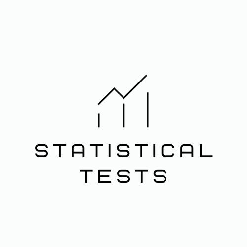

<a name="readme-top"></a>

![Contributors][contributors-shield]
![LinkedIn][linkedin-shield]


<!-- PROJECT LOGO -->
<br />
<div align="center">
  <a href="https://github.com/agatabiesiekierska/Statistical_tests">
    
  </a>

<h3 align="center">Statistical Tests</h3>

  <p align="center">
    This project is dedicated to providing a suite of basic statistical tests (Q-test and t-Student), empowering users to cleansing dataset by identification and rejection of outliers from their data.
    <br />
    <a href="https://github.com/agatabiesiekierska/Statistical_tests"><strong>Explore the docs »</strong></a>
    <br />
    <br />
    ·
    <a href="https://github.com/agatabiesiekierska/Statistical_tests/issues">Report Bug</a>
    ·
    <a href="https://github.com/agatabiesiekierska/Statistical_tests">Request Feature</a>
  </p>
</div>


<!-- TABLE OF CONTENTS -->
<details>
  <summary>Table of Contents</summary>
  <ol>
    <li>
      <a href="#about-the-project">About The Project</a>
      <ul>
        <li><a href="#built-with">Built With</a></li>
      </ul>
    </li>
    <li>
      <a href="#getting-started">Getting Started</a>
      <ul>
        <li><a href="#prerequisites">Prerequisites</a></li>
        <li><a href="#installation">Installation and Starting the program</a></li>
      </ul>
    </li>
    <li><a href="#usage">Usage</a></li>
    <li><a href="#contact">Contact</a></li>
  </ol>
</details>


<!-- ABOUT THE PROJECT -->
# About The Project

[![Program Screenshot][product-screenshot]](https://github.com/agatabiesiekierska/Statistical_tests)

<H2>Here's a simple program that performs a statistical test (Q-Dixon or t-Student) based on data in given .txt file</H2>

<p align="right">(<a href="#readme-top">back to top</a>)</p>


## Built With

* [![Python][Python]][Python-url]
* [![PyQt5][PyQt5]][PyQt5-url]

<p align="right">(<a href="#readme-top">back to top</a>)</p>


<!-- GETTING STARTED -->
## Getting Started

If you want to use this script, follow these instructions:

### Prerequisites

To use properly this program you need Python on your computer and PyQt5.
* Python    
[![Python][Python]][Python-url]

* PyQt5
  ```sh
  pip install PyQt5
  ```

### Installation and Starting the program

1. Clone the repo (or just download folder with all files)
   ```sh
   git clone https://github.com/agatabiesiekierska/Statistical_tests.git
   ```
2. Launch Windows PowerShell and move to the directory with files
   ```sh
   cd C:\Users\Your_UserName\Statistical_tests
   ```
4. Launch main.py file with Python
   ```sh
   python main.py
   ```
5. **(Alternatively)** Find main.py file and open with Python

<p align="right">(<a href="#readme-top">back to top</a>)</p>


<!-- USAGE EXAMPLES -->
## Usage

This paragraph will explain how to use this script

1. If you want to perform any test you need to type a location of your file with dataset (must have less than **11** measurements - it's related to critical value and consist only your measurments with dots or commas as decimal separator. File cannot have special signs or blank spaces - **otherwise the Error will appear**),

2. Type significance - confidence level - there are 3 values possible: **0.90, 0.95, 0.99**,

3. Type **Real Value** - a parameter needed only in t-Student test

4. Type path to export results for example: <br/> 
```
"C:\Users\Your_Username\Documents\results"
```
In the picture below you can see correctly entered values: <br/><br/>
[![Data Screenshot][app_window_2]]()

If everythig worked successfully the checkbox will appear: <br/><br/>
[![Checkbox Screenshot][results_1]]()

But if something went wrong, the user will get notification: <br/><br/>
[![ERROR][results_2]]()

5. The file with results will appear in given folder

In the picture below you can see the example output file in .txt format: <br/><br/>
[![Output Screenshot][output]]()


<p align="right">(<a href="#readme-top">back to top</a>)</p>


<!-- CONTRIBUTING -->
## Contributing

If you have a suggestion that would make this better, please fork the repo and create a pull request. 

1. Fork the Project
2. Create your Feature Branch (`git checkout -b feature/NewFeature`)
3. Commit your Changes (`git commit -m 'Add some NewFeature'`)
4. Push to the Branch (`git push origin feature/NewFeature`)
5. Open a Pull Request

<p align="right">(<a href="#readme-top">back to top</a>)</p>


<!-- CONTACT -->
## Contact

Agata Biesiekierska - [@linkedin_handle](https://linkedin.com/in/agata-biesiekierska-6293a4271/) - ag.biesiekierska@gmail.com

Project Link: [https://github.com/agatabiesiekierska/Statistical_tests](https://github.com/agatabiesiekierska/Statistical_tests)

<p align="right">(<a href="#readme-top">back to top</a>)</p>


<!-- MARKDOWN LINKS & IMAGES -->
<!-- https://www.markdownguide.org/basic-syntax/#reference-style-links -->
[contributors-shield]: https://img.shields.io/github/contributors/agatabiesiekierska/Statistical_tests.svg?style=for-the-badge
[contributors-url]: https://github.com/agatabiesiekierska/Statistical_tests/graphs/contributors

[issues-shield]: https://img.shields.io/github/issues/agatabiesiekierska/Statistical_tests.svg?style=for-the-badge
[issues-url]: https://github.com/agatabiesiekierska/Statistical_tests/issues

[linkedin-shield]: https://img.shields.io/badge/-LinkedIn-black.svg?style=for-the-badge&logo=linkedin&colorB=555
[linkedin-url]: https://linkedin.com/in/agata-biesiekierska-6293a4271/

[product-screenshot]: images/app_window.png
[app_window_2]: images/app_window_2.png
[results_1]: images/results_1.png
[results_2]: images/result_2.png
[output]: images/output.png

[Python]: https://img.shields.io/badge/python-blue?logo=python&logoColor=white
[Python-url]: https://www.python.org/downloads

[PyQt5]: https://img.shields.io/badge/PyQt5-red?logo=python&logoColor=white
[PyQt5-url]: https://pypi.org/project/PyQt5/
